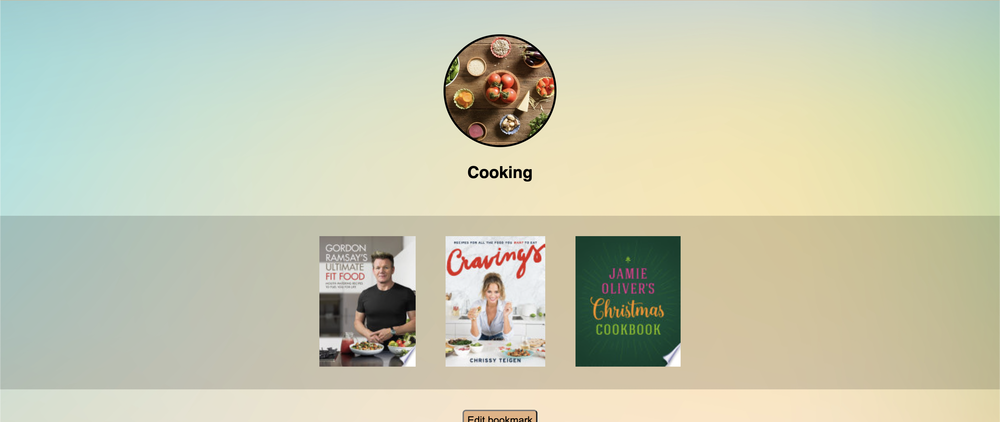
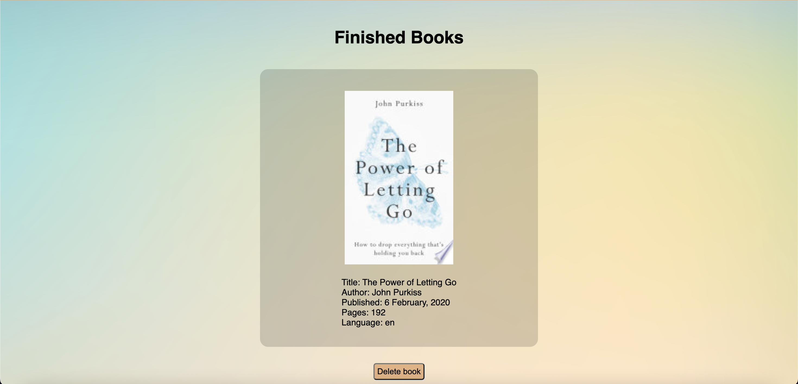
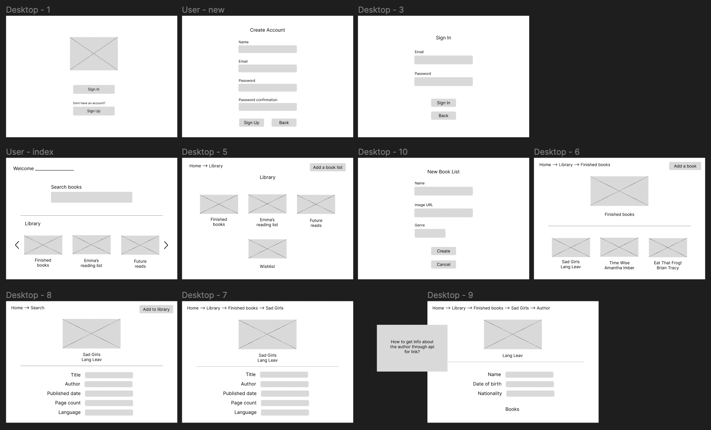

# Book Tracker (Ruby on Rails)

## Access the app here:
https://project-2-book-tracker.herokuapp.com/

   

---
    

## What is it?

This book tracker aims to help organise all of your books digitally with the help of bookmark categories. Think of it as virtual libraries for any book that you have or future books that you want!

   

### How to use:
1. If you don't already have an account, navigate to the sign up page and create an account.
2. If you have an account, navigate to the sign in page and log in.
3. Navigate to the bookmarks page and create a new bookmark.
4. Navigate to the home page and in the search bar, search for any book to find information about it.
5. You have the option to add the book to any of your bookmarks.
6. In any of your bookmarks, you can edit the name and image at anytime or you could delete a book from it by clicking on the book in that bookmark and pressing the 'delete book' button at the bottom of the page.

   

### Example use cases:

   

---
  

## Design Prototype

